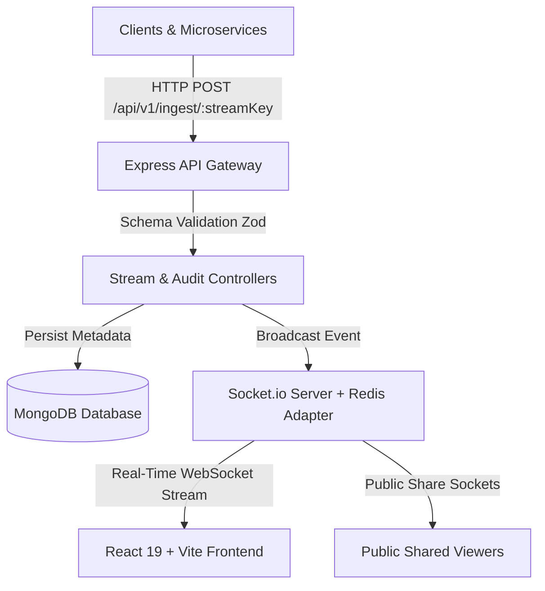

# Streamline ⚡

> **Real-Time Data Telemetry & Webhook Dashboard Platform**  
> Connect your data streams — however they arrive — and watch them transform into live, interactive visual dashboards in real time. Zero spreadsheets. Zero scripts. Zero polling delays.


---

## 🌟 Key Highlights & Features

- **⚡ Sub-15ms Real-Time Ingestion**: Instant data ingestion via REST webhooks (`POST /api/v1/ingest/:streamKey`) with Socket.io real-time event propagation.
- **📊 Multi-Widget Customizable Dashboards**:
  - **Single Metric Stat Cards**: Min/Max/Avg calculation and live change indicators.
  - **Threshold Gauge Progress Bars**: Capacity and quota visual tracking.
  - **Real-Time Event Log Feed**: Live scrolling payload ticker.
  - **SVG Telemetry Line Charts**: Animated line plots with pulsing data nodes.
- **🏢 Multi-Tenant Workspaces & RBAC**: Role-Based Access Control (`Owner`, `Editor`, `Viewer`) with team invitations and 48-hour signed token authentication.
- **🛡️ Security & Audit Logging**: Immutable workspace security audit trail (`MEMBER_INVITED`, `DASHBOARD_SHARE_TOGGLED`), Helmet security headers, rate limiting, and HTTP-only JWT cookies.
- **🌐 Public Read-Only Share Links**: Zero-auth share links (`/share/:shareToken`) with atomic view counters for clients and external stakeholders.
- **💻 Multi-Language Code Snippet Generator**: Automatic code snippet generation for **cURL**, **JavaScript `fetch`**, and **Python `requests`**.

---

## 🏗️ Architecture & Technology Stack



### **Tech Stack**
- **Frontend**: React 19, TypeScript, Tailwind CSS v4, Zustand, Lucide Icons, Vite
- **Backend**: Node.js, Express 5, Socket.io, `@socket.io/redis-adapter`
- **Database & Cache**: MongoDB (Mongoose ORM), Redis (Pub/Sub & Socket Adapter)
- **Security & Validation**: JWT Authentication, Zod Schema Validation, Helmet, Rate Limiter

---

## 🚀 Quick Start Guide

### Prerequisites
- **Node.js**: `v20.x` or later
- **Docker Desktop**: (Optional, for running MongoDB & Redis containers)

### 1. Clone & Install Dependencies
```bash
git clone https://github.com/maanav-11/Streamline.git
cd Streamline

# Install root, client, and server dependencies
npm install
cd client && npm install
cd ../server && npm install
```

### 2. Configure Environment Variables
Create a `.env` file in `server/`:
```env
MONGODB_URI=mongodb://localhost:27017/streamline
JWT_SECRET=your_super_secret_jwt_key
PORT=5000
REDIS_URL=redis://localhost:6379
CLIENT_URL=http://localhost:5173
```

### 3. Start Database Infrastructure (Docker)
```bash
docker compose up -d mongodb redis
```

### 4. Run Development Servers
```bash
# Terminal 1: Start Backend Server
cd server
npm run dev

# Terminal 2: Start Frontend Client
cd client
npm run dev
```

Open your browser at **`http://localhost:5174/`** (or `http://localhost:5173/`).

---

## 📡 API Reference

### **Data Ingestion (Public Webhook)**
```http
POST /api/v1/ingest/:streamKey
Content-Type: application/json

{
  "value": 84.5,
  "label": "CPU Utilization Metric",
  "metadata": { "env": "production", "region": "us-east-1" }
}
```

### **Authentication Endpoints**
| Method | Endpoint | Description |
| :--- | :--- | :--- |
| `POST` | `/api/auth/register` | Register new user & auto-create workspace |
| `POST` | `/api/auth/login` | Authenticate user & issue JWT |
| `GET` | `/api/auth/profile` | Validate active JWT session |
| `POST` | `/api/auth/logout` | Clear auth cookies & terminate session |

### **Workspace & Stream Endpoints**
| Method | Endpoint | Access | Description |
| :--- | :--- | :--- | :--- |
| `GET` | `/api/workspaces` | Protected | Fetch user workspaces |
| `POST` | `/api/streams` | Owner / Editor | Create new stream key endpoint |
| `GET` | `/api/streams/workspace/:wsId` | Member | Fetch workspace streams |
| `PATCH` | `/api/dashboards/:id/widgets` | Owner / Editor | Update dashboard widget grid |
| `GET` | `/api/workspaces/:id/audit-logs` | Member | Fetch workspace audit logs |
| `GET` | `/api/v1/dashboards/share/:token` | Public | Access shared read-only dashboard |

---

## 💻 Integration Snippets

### **cURL**
```bash
curl -X POST "http://localhost:5000/api/v1/ingest/strm_your_stream_key" \
  -H "Content-Type: application/json" \
  -d '{"value": 92.4, "label": "API Response Latency"}'
```

### **JavaScript (Fetch)**
```js
fetch("http://localhost:5000/api/v1/ingest/strm_your_stream_key", {
  method: "POST",
  headers: { "Content-Type": "application/json" },
  body: JSON.stringify({ value: 92.4, label: "API Response Latency" })
});
```

### **Python (Requests)**
```python
import requests

requests.post(
    "http://localhost:5000/api/v1/ingest/strm_your_stream_key",
    json={"value": 92.4, "label": "API Response Latency"}
)
```

---

## 🔒 Security & Code Quality

- **RBAC Middleware**: Strict role authorization (`checkRole('owner', 'editor')`) guarding administrative workspace actions.
- **Auditing**: Automatic audit trail generation for team invitations, dashboard share toggles, and stream mutations.
- **Production Build**: Verified with TypeScript strict mode (`tsc && vite build`).

---

## 📄 License
This project is licensed under the [ISC License](LICENSE).
